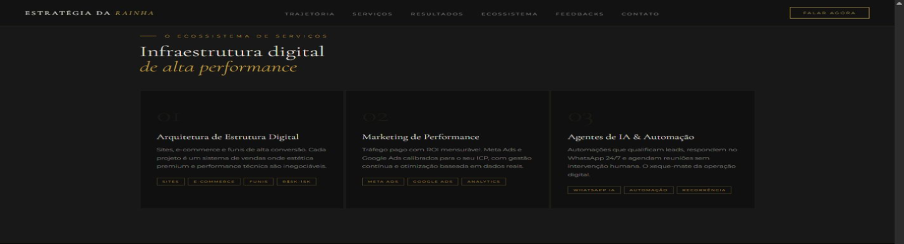
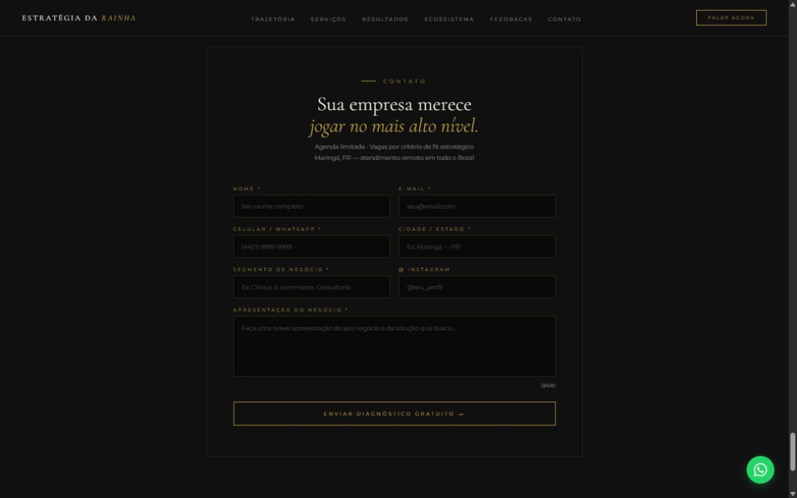

<div align="center">

# Estratégia da Rainha

### An institutional web experience built around positioning, proof and conversion

**Web development case study · Product experience · Responsive implementation**

</div>

<p align="center">
  
  &nbsp;
  
</p>

> This is a public, documentary case study. It describes the verified website experience and implementation without publishing source code, private configuration, lead data, contact identifiers or internal business documentation.

## Project overview

Estratégia da Rainha is a live institutional website that connects brand positioning, professional authority, portfolio evidence, service presentation and lead conversion in a single responsive experience.

The project was treated as a digital product rather than a static personal page. Its information architecture guides visitors from the brand premise to relevant capabilities, work evidence, service offers and two clear conversion paths: direct conversation and an on-site diagnostic form.

The public website was accessible at the time of this audit:

**[Visit Estratégia da Rainha](https://estrategiadarainha.com.br/)**

## Problem / objective

The website needed to organize a broad professional narrative into a coherent commercial experience. Visitors had to understand the positioning, identify the available capabilities, review credibility signals and reach an appropriate contact path without navigating across disconnected channels.

The verified objective of the interface is to:

- establish a clear strategic positioning;
- present services and areas of expertise;
- connect professional trajectory with execution evidence;
- organize cases, media, events and partnerships;
- support consideration through portfolio and social-proof sections;
- convert qualified interest into a diagnostic request or direct conversation.

The public copy addresses businesses and professionals looking for digital structure, positioning, performance, web projects and automation. This audience description is based on the language and offers currently visible on the site; it is not presented as independently validated market research.

## Solution

I designed and implemented a long-form institutional experience with:

- a strong brand-led hero and persistent navigation;
- section-based storytelling within a single page;
- an authority and positioning narrative;
- service and capability presentation;
- project, event, media and partnership galleries;
- embedded video content;
- interactive carousels and image viewing;
- direct WhatsApp calls to action;
- a structured diagnostic form;
- responsive layouts for desktop and mobile.

## Information architecture

```text
Brand entry / Hero
        ↓
Authority & Manifesto
        ↓
Capabilities / Problems addressed
        ↓
Professional trajectory
        ↓
Executed work & results
        ↓
Extended ecosystem
        ↓
Service architecture
        ↓
Social proof
        ↓
Diagnostic request / Direct conversation
```

The public navigation exposes direct anchors to **Trajectory**, **Services**, **Results**, **Ecosystem**, **Feedbacks** and **Contact**. The page also connects to external authority references and social channels.

## User journey

1. **Orientation** — the hero communicates the brand premise and primary positioning.
2. **Credibility** — authority references and the manifesto establish context.
3. **Relevance** — capability cards explain the categories of problems addressed.
4. **Evidence** — trajectory, executed work, events, media and ecosystem sections provide supporting material.
5. **Evaluation** — the service structure presents the commercial offer in a clear hierarchy.
6. **Action** — visitors can start a direct conversation or submit the diagnostic form.

This is the intended journey inferred from the verified page order, navigation and calls to action. No analytics or measured funnel performance is claimed.

## Responsive experience

Responsiveness was verified in both the public website and the preserved local implementation.

- the page declares a responsive viewport;
- the stylesheet contains multiple breakpoint-specific media-query blocks;
- desktop navigation is condensed on the mobile layout while the primary CTA remains available;
- the hero, content sections and form adapt to the narrower viewport;
- the audited mobile viewport showed no horizontal page overflow;
- the form fields fit the mobile content width.

The mobile frame below documents the rendered interface rather than a design mockup.

## Screenshots

These frames were captured from the live public website. No form was filled or submitted. The service frame was cropped before publication to exclude a third-party testimonial, and the selected images contain no lead data, private contact identifiers or internal information.

### Desktop hero and navigation


The hero combines the visual identity, positioning statement, desktop navigation and a persistent direct-contact CTA.

### Service architecture



The offer is organized into distinct service pillars, using a consistent hierarchy of category, description and supporting tags.

### Conversion form



The final conversion section collects the information required for an initial business diagnostic. The published frame contains placeholders only and no submitted data.

### Mobile experience

<p align="center">
  
</p>

The mobile layout preserves the brand, primary CTA and positioning while simplifying the desktop navigation structure.

## Technology stack

| Area | Verified technology or approach |
| --- | --- |
| Page structure | Semantic HTML in a single-page institutional experience |
| Styling | CSS, custom visual tokens and responsive media queries |
| Interaction | Vanilla JavaScript |
| Typography | Google Fonts: Cormorant Garamond and Montserrat |
| Form integration | FormSubmit using an HTML POST form |
| Media | Responsive images and embedded YouTube content |
| Deployment | Live HTTPS website on a custom domain |
| Local delivery package | Static HTML plus a background video asset |

No external JavaScript framework was detected on the audited public page. The hosting provider itself could not be verified from the available evidence, so it is intentionally not named.

## My role

I worked across the project from product definition to implementation, including:

- defining the website objective and positioning structure;
- organizing the information architecture and conversion journey;
- creating the responsive visual direction and interface hierarchy;
- implementing the page in HTML, CSS and JavaScript;
- structuring navigation, carousels, lightbox behavior and embedded media;
- integrating the diagnostic form and direct-contact paths;
- preparing the static delivery package;
- reviewing the live desktop and mobile experience.

## Product and design decisions

- **Single-page narrative:** the experience keeps positioning, proof, services and conversion in one continuous journey.
- **Authority before offer:** the page establishes context and evidence before presenting the commercial structure.
- **Premium visual system:** a dark palette, gold accents, serif typography and chess references support the positioning without replacing usability.
- **Persistent conversion access:** a direct-contact CTA remains visible in the navigation and as a floating action.
- **Structured evidence:** carousels and embedded media accommodate a broad portfolio without turning the page into a flat gallery.
- **Lightweight implementation:** HTML, CSS and vanilla JavaScript keep the delivery model simple and compatible with static hosting.
- **External form processing:** the contact flow uses a form service rather than exposing custom backend code in the public page.

## Conversion structure

```text
Positioning
    ↓
Authority and professional context
    ↓
Capabilities and evidence
    ↓
Service evaluation
    ↓
Primary action: direct conversation
Secondary action: diagnostic form
```

The implementation provides the conversion mechanisms above. It does not prove lead volume, conversion rate, revenue or commercial performance.

## What was verified

### Verified on the public website

- live HTTPS access on the custom domain;
- a single-page structure with ten major content sections;
- anchored desktop navigation and a persistent contact CTA;
- direct WhatsApp calls to action;
- an on-site diagnostic form with required business-context fields;
- FormSubmit as the form-processing integration;
- image carousels, lightbox behavior and six embedded YouTube videos;
- external authority and social links;
- responsive rendering on desktop and mobile;
- no horizontal overflow in the audited mobile viewport;
- inline CSS and vanilla JavaScript with no external JavaScript framework detected.

### Verified in local materials

- preserved HTML iterations from v2 through v4;
- a latest single-page HTML implementation containing the published structure;
- inline styling and interaction logic;
- a static deployment archive containing the page and a chess-themed background video;
- local visual and editorial materials used during the project.

### Product interpretation based on evidence

- the section order forms a progressive positioning-to-conversion narrative;
- the primary audience is inferred from the current service language and calls to action;
- the site functions as an institutional acquisition experience, not only as a personal presentation page.

### Not verified

- the exact hosting provider or deployment pipeline;
- analytics, traffic, lead, conversion or revenue metrics;
- successful delivery of a real form submission, because the public form was not submitted during the audit;
- a CMS, administrative dashboard, database or custom backend;
- a formal accessibility certification;
- exhaustive cross-browser or performance benchmarking;
- current business availability beyond the fact that the website is publicly accessible.

## Current status

| Status | Scope |
| --- | --- |
| **Public and accessible** | The institutional website was live on its custom HTTPS domain during the audit |
| **Verified interface** | Navigation, long-form structure, media galleries, service presentation and conversion paths |
| **Verified responsive behavior** | Desktop and mobile layouts, condensed mobile navigation and no audited horizontal overflow |
| **Verified local implementation** | Static HTML, CSS, JavaScript and delivery package |
| **Not independently verified** | Hosting provider, analytics, form delivery outcomes and commercial metrics |
| **Kept private** | Source files, full media archive, contact identifiers, lead data and internal documentation |

## Key learnings

- An institutional site becomes a product when every section has a defined role in the visitor journey.
- Brand expression and conversion structure can coexist when hierarchy and navigation remain clear.
- Long-form pages need deliberate pacing: positioning, proof, offer and action should not compete at the same moment.
- Responsive work is not limited to resizing components; it requires deciding what remains prominent on smaller screens.
- External integrations can keep a static implementation lightweight, but their operational success should be distinguished from interface-level verification.
- A responsible public case must separate what the interface implements from what analytics or business outcomes would be required to prove.

---

<div align="center">

**[Visit the live website](https://estrategiadarainha.com.br/)**

Built by **Carolliny Soares** · AI Product Engineer & Software Developer

</div>
